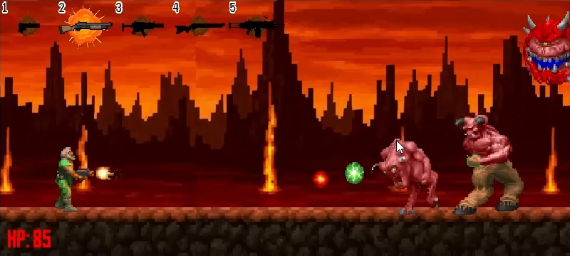
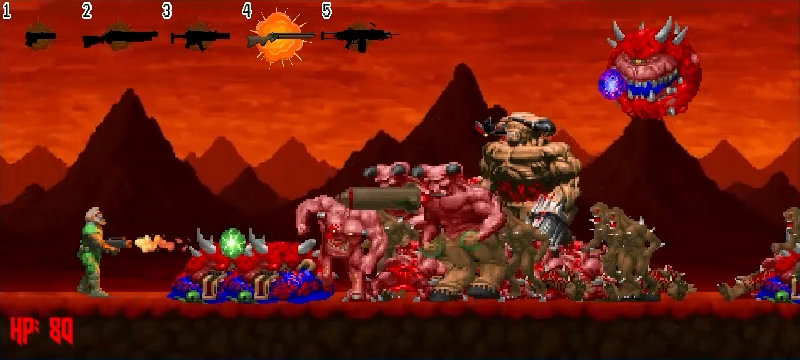
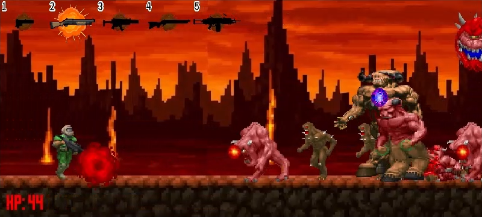

# game_platformer_2d

A platformer game based on DOOM on PyGame

________________________________

Управление:

W, A, D - Ходьба и прыжок.

LSHIFT и RSHIFT - Бег.

Пробел - Стрельба.

Цифры - Выбор оружия.

________________________________

Смотреть демо видео на GitHub Pages - https://romaniston.github.io/game_platformer_2d/

<video width="800" controls>
  <source src="demo/demo.mp4" type="video/mp4">
</video>

________________________________

Screenshots:
 

</img>

</img>

</img>
