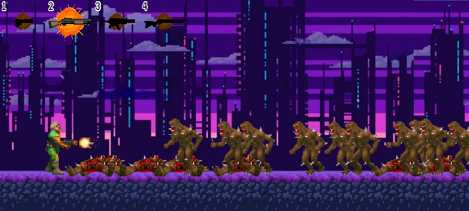
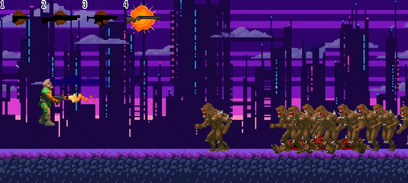

# game_platformer_2d
A platformer game based on DOOM on PyGame
________________________________
Управление:
W, A, D - ходьба и прыжок.
Пробел - стрельба.
Цифры - выбор оружия.
________________________________
Screenshots:
 

</img>

</img>

</img>
