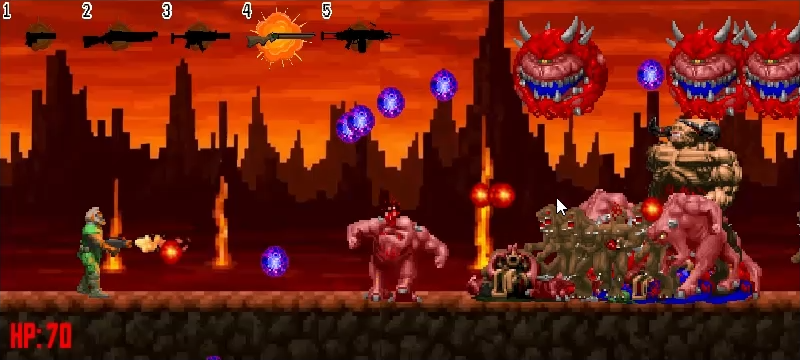

# game_platformer_2d
A platformer game based on DOOM on PyGame
________________________________
Управление:
W, A, D - Ходьба и прыжок.
LSHIFT и RSHIFT - Бег.
Пробел - Стрельба.
Цифры - Выбор оружия.
________________________________
Screenshots:
 

</img>

</img>

</img>
________________________________
Demo:
 

<video width="800" controls>
  <source src="demo/demo.mp4" type="video/mp4">
</video>

